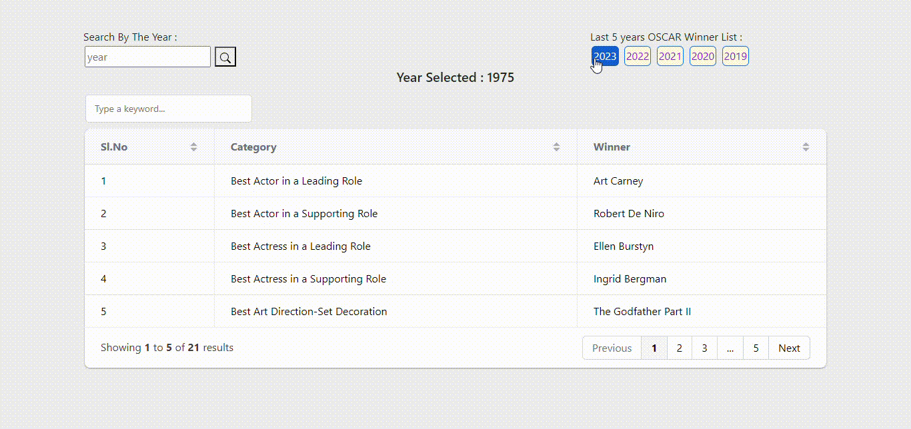

# oscar_winners_list_frontend
This is a frontend of the "Oscar Winner List" project

## A bit about OSCAR
The Academy Awards, also known as the Oscars, is an annual awards ceremony honoring outstanding creative and technical achievements in the film industry. The awards are presented by the Academy of Motion Picture Arts and Sciences, and winners are selected by the Academy's voting membership. The various category winners are awarded a copy of a golden statuette, officially called the "Academy Award of Merit," but more commonly referred to by its nickname, the "Oscar".

## API sourced: https://github.com/abhisaha15/oscar_winners_list_backend_services

### Framework used:
<b>Bootstrap</b>: Bootstrap is a popular front-end framework used for web development, providing a set of pre-designed components and styles to streamline the process of building responsive websites.

### Libraries used:

<b>Grid.js</b>: Grid.js is a JavaScript library that enhances the user experience of working with tabular data in web applications. It provides features like sorting, filtering, pagination, and editing capabilities. With a simple API, it allows you to create interactive and responsive data grids, customize appearance and behavior, and incorporate advanced features like grouping and data export. Grid.js stands out for its performance optimization, handling large datasets efficiently without compromising speed or responsiveness. Overall, Grid.js is a versatile tool for creating dynamic and interactive data tables in web applications, improving usability and functionality.

## How It Works:

### Homepage:

### Scenario-1:

### Scenario-2:

### Scenario-3:

### Scenario-4:

### Scenario-5:

### Scenario-6:

## Summary:

I am grateful to <a href="https://getbootstrap.com/">Bootstrap</a> and <a href="https://gridjs.io/docs">Grid.js</a> for the convenience and efficiency they have brought to my web development projects. These frameworks and libraries have greatly enhanced my workflow and made it easier to create responsive and interactive websites.
 
I would also like to thank Mr.Sankha Subhra Mondal as his <a href="https://github.com/Sankha1998/pre-built-database-MySql">repository</a> and <a href="https://github.com/Sankha1998">profile</a> have been a valuable source of inspiration, offering solutions and insights that shaped my project's success. His meticulous commits and clear codebase made complex concepts easier to understand, enhancing our knowledge. I am grateful for his open-mindedness and generosity in sharing his expertise, which has elevated my project and improved my development skills. His repositories have been guiding lights in the intricate and ever-evolving world of software development, and I deeply appreciate the time and effort you've dedicated to creating and maintaining them.
